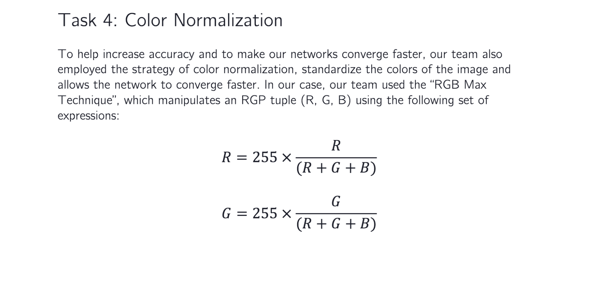

# Python Image Preprocessing
Since the end of my training period at my internship, I have been asked to implement a plethora of image preprocessing algorithms from scratch in Python. In this report, I discuss a couple of the tasks I have been able to accomplish. 

